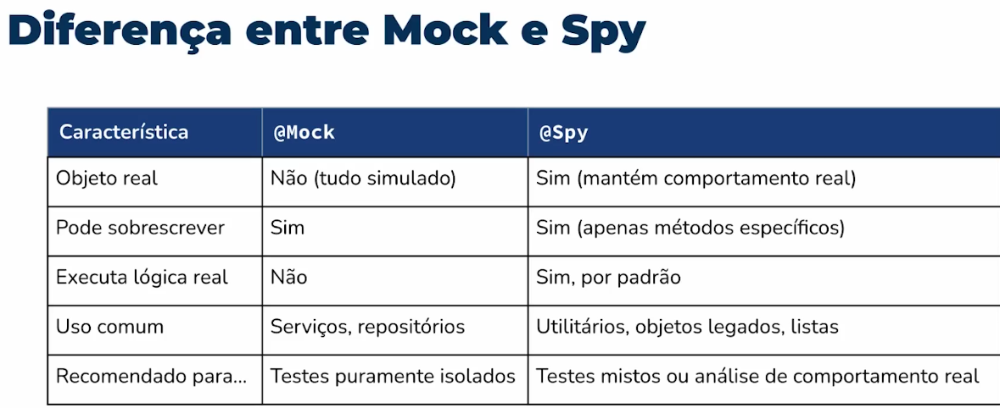

# Testes
Teste é documentação que, de maneira simples, mostra o comportamento do sistema. 
Testes automatizados (unitário ou de integração), são códigos escritos que testam outros códigos. 
Substituem testes manuais, permitindo reexecução constante e com menor custo e são fundamentais em ambientes com CI/CD e manutenção contínua. 

# Teste de Integracao
Repositório para armazenamento de código com exemplos de implementação de teste de integração com JUnit, e testes automatizados com Selenium.

Aplicação utilizando SpringBoot apenas devido a facilidade/ comodidade em subir a aplicação. A camada Dao não foi implementada com repository, e sim com JPA(EntityManager) para simular uma aplicação legada. 
Nesse projeto foram implementados testes de integração com o banco de dados, utilizando o JUnit. 
Acesse http://localhost:8080/leiloes >> Em login, acesse com fulano | pass

# TDD - Test-Driven Development
Desenvolvimento orientado a testes - baseado em ciclo:
- Red: 1° escreve-se um teste que falha para uma funcionalidade ainda inexistente.
- Green: 2° escreve-se o código mínimo necessário para o teste passar.
- Refactor: por fim, refatora-se o código para melhorar sua qualidade e ligibilidade, mantendo todos os testes passando.

## Limitações
Apesar de eficaz, o TDD tem limitações:
- Não substitui testes de integração ou end-to-end. O TDD é para teste unitário.
- Pode ser inadequado para interfaces gráficas complexas.
- Requer disciplina e mudança de mentalidade.
- Não garante bom design por si só.

## Vantages
O TDD molda o design desde o início, permite feedback imediato e encoraja modularidade e testabilidade. Já o TAD, não influencia o 
design e oferece menos segurança para refatorar.

# TAD - Test After Development
No mercado, é comum desenvolver a solução antes dos testes, ou seja, escrever os testes após a implementação. 
O principal problema disso é não conseguir pensar em todos os cenários de testes.

# Dicas
- Nomeie os testes de forma clara e descritiva: um bom nome de teste comunica a intenção do comportamento validado.
- Faça um teste por comportamento, ex: num mesmo teste, não valide a soma e a subtração.

# Spy
É um tipo especial de mock, que permite executar o comportamento real do objeto (espia o objeto). São úteis quando:
- Você quer manter o comportamento real da classe, mas controlar partes específicas
- Precisa monitorar interações com objetos que não foram injetados como mocks
- Está testando objetos de bibliotecas ou legados sem possibilidade de injeção de dependência

